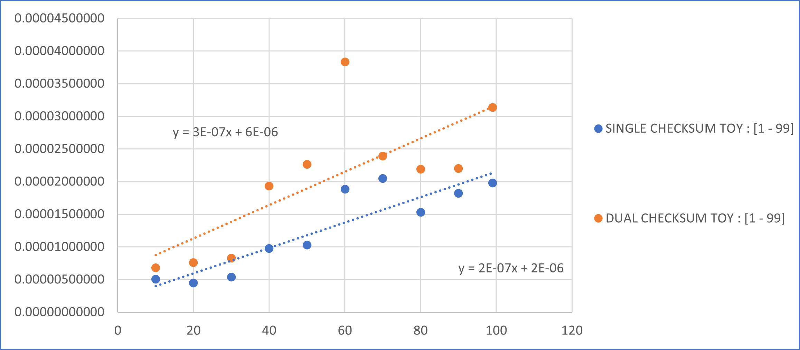

##TIEMPOS DE EJECUCIÓN

El análisis de los resultados obtenidos es esencial para desentrañar la eficiencia y el comportamiento del algoritmo CheckSum en diferentes situaciones. 

Para el proceso de experimentación, hemos creado diferentes entradas, respecto al tipo de dato. Los rangos que van a tomar las longitudes es :

TOY : [1<n<100]

PEQUEÑO : [1000<n<10000]

MEDIANO : [10000<n<100000]

GRANDE : [1000000<n<6000000]

Hemos usado dos diferentes algoritmos para realizar CheckSum. "Single CheckSum" y "Dual CheckSum". En esta sección, mostraremos los resultados de los tiempos de ejecución por cada dato de diferentes longitudes, n recorriendo el intervalo perteneciente al tipo de dato.

|SINGLE CHECKSUM TOY : [1 - 99]| | | | | | | | | | |
|:---:|:---:|:---:|:---:|:---:|:---:|:---:|:---:|:---:|:---:|:---:|
| | | | | | | | | | | |
| |10|20|30|40|50|60|70|80|90|99|
|1|0.000007730|0.000004770|0.000013560|0.000028300|0.000010800|0.000013000|0.000021100|0.000016500|0.000021600|0.000021500|
|2|0.000005650|0.000004470|0.000007230|0.000007900|0.000010000|0.000011500|0.000020600|0.000015100|0.000017100|0.000019300|
|3|0.000004640|0.000005040|0.000007390|0.000007600|0.000010100|0.000011200|0.000020400|0.000015200|0.000017000|0.000019300|
|4|0.000005030|0.000004500|0.000007550|0.000007800|0.000012200|0.000022000|0.000020400|0.000015200|0.000017100|0.000020200|
|5|0.000005950|0.000004190|0.000007480|0.000007800|0.000010000|0.000021700|0.000020400|0.000015200|0.000017000|0.000019200|
|6|0.000004900|0.000004460|0.000003420|0.000007700|0.000010000|0.000021100|0.000020200|0.000015200|0.000017100|0.000019200|
|7|0.000004340|0.000004370|0.000001180|0.000007600|0.000010100|0.000020700|0.000020300|0.000015100|0.000016700|0.000019200|
|8|0.000004220|0.000004270|0.000003510|0.000007500|0.000009900|0.000025500|0.000020500|0.000015200|0.000017100|0.000021300|
|9|0.000004180|0.000004210|0.000001230|0.000007600|0.000009900|0.000020700|0.000019200|0.000015200|0.000016900|0.000019300|
|10|0.000003990|0.000004190|0.000001170|0.000007600|0.000009900|0.000020800|0.000021400|0.000015100|0.000024500|0.000019200|
|AVERAGE TIME|0.00000506300|0.00000444700|0.00000537200|0.00000974000|0.00001029000|0.00001882000|0.00002045000|0.00001530000|0.00001821000|0.00001977000|

_____

|DUAL CHECKSUM TOY : [1 - 99]| | | | | | | | | | |
|:----|:----|:----|:----|:----|:----|:----|:----|:----|:----|:----|
| | | | | | | | | | | |
| |10|20|30|40|50|60|70|80|90|99|
|1|0.000008489|0.000007970|0.000006380|0.000037900|0.000045500|0.000079800|0.000029500|0.000039700|0.000024500|0.000028800|
|2|0.000005458|0.000007060|0.000029800|0.000016500|0.000022200|0.000031400|0.000027200|0.000018500|0.000022600|0.000037700|
|3|0.000007240|0.000008220|0.000002590|0.000019700|0.000020600|0.000039500|0.000021800|0.000018300|0.000020500|0.000034600|
|4|0.000008150|0.000007090|0.000002830|0.000016600|0.000019100|0.000031300|0.000022700|0.000018800|0.000022500|0.000032800|
|5|0.000007150|0.000007270|0.000002660|0.000016600|0.000019200|0.000031700|0.000028600|0.000018300|0.000020500|0.000028900|
|6|0.000002043|0.000007980|0.000028600|0.000017200|0.000019800|0.000032800|0.000021300|0.000020400|0.000022600|0.000031300|
|7|0.000007230|0.000007160|0.000002480|0.000016500|0.000020500|0.000034000|0.000023100|0.000018200|0.000020200|0.000031000|
|8|0.000008630|0.000008820|0.000002580|0.000017200|0.000019600|0.000038200|0.000020800|0.000019900|0.000022200|0.000028900|
|9|0.000006880|0.000007230|0.000002610|0.000016500|0.000020900|0.000031100|0.000023200|0.000017400|0.000022300|0.000030500|
|10|0.000006600|0.000006940|0.000002450|0.000018400|0.000018800|0.000033500|0.000021000|0.000029500|0.000022200|0.000028800|
|AVERAGE TIME|0.00000678700|0.00000757400|0.00000829800|0.00001931000|0.00002262000|0.00003833000|0.00002392000|0.00002190000|0.00002201000|0.00003133000|

Gráfico de comparación

