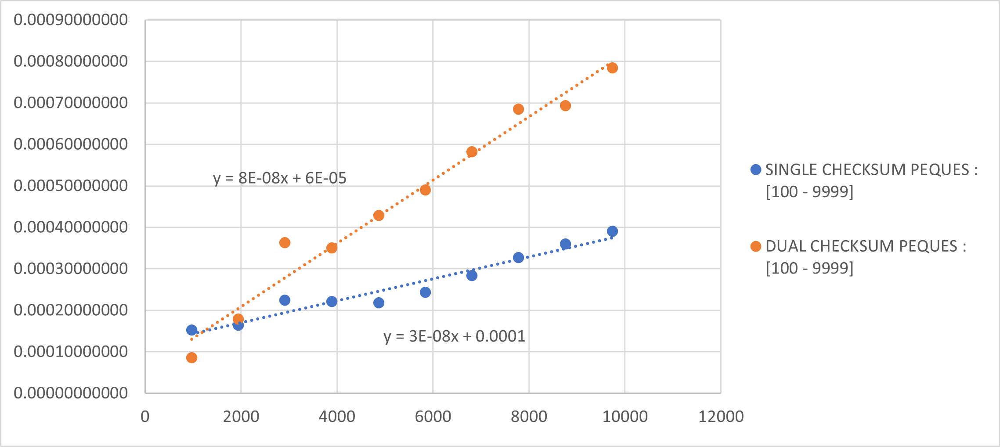
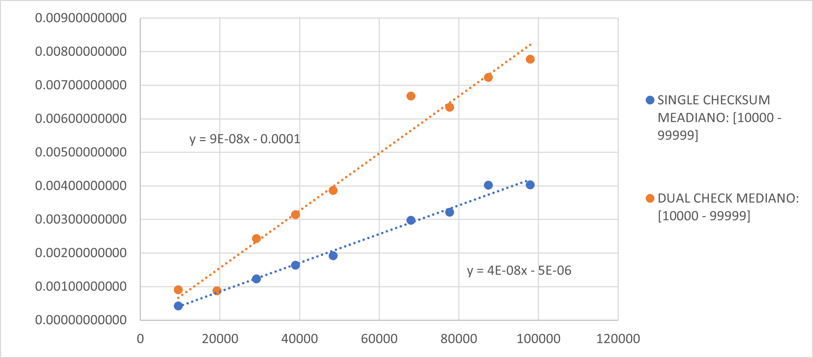
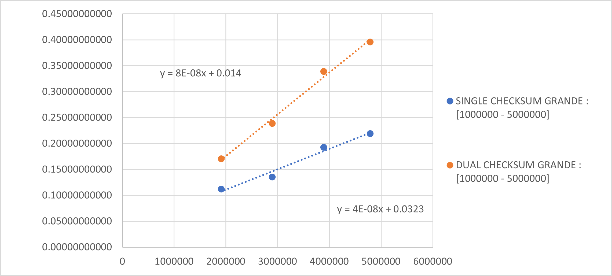

# CALCULO DE COMPLEJIDAD

### Método del maestro

Usaremos el método del maestro para calcular la complejidad del algoritmo Single Sum. Como este algoritmo no utiliza otros mecanismos de optimización de ejecución, como "Divide y Vencerás", sabemos que la lista que se entrega como entrada no es dividida en ningún momento. Por lo tanto, la relación de recurrencia para este algoritmo es:

$T_(n) = T(\frac{n}{1}) + O(n)$

La complejidad del algoritmo es O(log n) debido a que el numero de niveles de recursión es

log_bn

Y en cada nivel se realiza un trabajo Constante O(1)

# ANALISIS DE TIEMPOS DE EJECUCIÓN

El análisis de los resultados obtenidos es esencial para desentrañar la eficiencia y el comportamiento del algoritmo CheckSum en diferentes situaciones. 

Para el proceso de experimentación, hemos creado diferentes entradas, respecto al tipo de dato. Los rangos que van a tomar las longitudes es :

TOY : [1<n<100]

PEQUEÑO : [1000<n<10000]

MEDIANO : [10000<n<100000]

GRANDE : [1000000<n<6000000]

Hemos usado dos diferentes algoritmos para realizar CheckSum. "Single CheckSum" y "Dual CheckSum". En esta sección, mostraremos los resultados de los tiempos de ejecución por cada dato de diferentes longitudes, n recorriendo el intervalo perteneciente al tipo de dato.
Luego podemos observar la gráfica que relaciona el tiempo de ejecución versus el tamaño de la entrada. Para ambos algoritmos analizados.

_____

# TOY

|SINGLE CHECKSUM TOY : [1 - 99]| | | | | | | | | | |
|:---:|:---:|:---:|:---:|:---:|:---:|:---:|:---:|:---:|:---:|:---:|
| | | | | | | | | | | |
| |10|20|30|40|50|60|70|80|90|99|
|1|0.000007730|0.000004770|0.000013560|0.000028300|0.000010800|0.000013000|0.000021100|0.000016500|0.000021600|0.000021500|
|2|0.000005650|0.000004470|0.000007230|0.000007900|0.000010000|0.000011500|0.000020600|0.000015100|0.000017100|0.000019300|
|3|0.000004640|0.000005040|0.000007390|0.000007600|0.000010100|0.000011200|0.000020400|0.000015200|0.000017000|0.000019300|
|4|0.000005030|0.000004500|0.000007550|0.000007800|0.000012200|0.000022000|0.000020400|0.000015200|0.000017100|0.000020200|
|5|0.000005950|0.000004190|0.000007480|0.000007800|0.000010000|0.000021700|0.000020400|0.000015200|0.000017000|0.000019200|
|6|0.000004900|0.000004460|0.000003420|0.000007700|0.000010000|0.000021100|0.000020200|0.000015200|0.000017100|0.000019200|
|7|0.000004340|0.000004370|0.000001180|0.000007600|0.000010100|0.000020700|0.000020300|0.000015100|0.000016700|0.000019200|
|8|0.000004220|0.000004270|0.000003510|0.000007500|0.000009900|0.000025500|0.000020500|0.000015200|0.000017100|0.000021300|
|9|0.000004180|0.000004210|0.000001230|0.000007600|0.000009900|0.000020700|0.000019200|0.000015200|0.000016900|0.000019300|
|10|0.000003990|0.000004190|0.000001170|0.000007600|0.000009900|0.000020800|0.000021400|0.000015100|0.000024500|0.000019200|
|AVERAGE TIME|0.00000506300|0.00000444700|0.00000537200|0.00000974000|0.00001029000|0.00001882000|0.00002045000|0.00001530000|0.00001821000|0.00001977000|

_____

|DUAL CHECKSUM TOY : [1 - 99]| | | | | | | | | | |
|:----|:----|:----|:----|:----|:----|:----|:----|:----|:----|:----|
| | | | | | | | | | | |
| |10|20|30|40|50|60|70|80|90|99|
|1|0.000008489|0.000007970|0.000006380|0.000037900|0.000045500|0.000079800|0.000029500|0.000039700|0.000024500|0.000028800|
|2|0.000005458|0.000007060|0.000029800|0.000016500|0.000022200|0.000031400|0.000027200|0.000018500|0.000022600|0.000037700|
|3|0.000007240|0.000008220|0.000002590|0.000019700|0.000020600|0.000039500|0.000021800|0.000018300|0.000020500|0.000034600|
|4|0.000008150|0.000007090|0.000002830|0.000016600|0.000019100|0.000031300|0.000022700|0.000018800|0.000022500|0.000032800|
|5|0.000007150|0.000007270|0.000002660|0.000016600|0.000019200|0.000031700|0.000028600|0.000018300|0.000020500|0.000028900|
|6|0.000002043|0.000007980|0.000028600|0.000017200|0.000019800|0.000032800|0.000021300|0.000020400|0.000022600|0.000031300|
|7|0.000007230|0.000007160|0.000002480|0.000016500|0.000020500|0.000034000|0.000023100|0.000018200|0.000020200|0.000031000|
|8|0.000008630|0.000008820|0.000002580|0.000017200|0.000019600|0.000038200|0.000020800|0.000019900|0.000022200|0.000028900|
|9|0.000006880|0.000007230|0.000002610|0.000016500|0.000020900|0.000031100|0.000023200|0.000017400|0.000022300|0.000030500|
|10|0.000006600|0.000006940|0.000002450|0.000018400|0.000018800|0.000033500|0.000021000|0.000029500|0.000022200|0.000028800|
|AVERAGE TIME|0.00000678700|0.00000757400|0.00000829800|0.00001931000|0.00002262000|0.00003833000|0.00002392000|0.00002190000|0.00002201000|0.00003133000|

_____

## Gráfico

_____

# PEQUEÑO
|SINGLE CHECKSUM PEQUES : [100 - 9999]| | | | | | | | | | |
|:---:|:---:|:---:|:---:|:---:|:---:|:---:|:---:|:---:|:---:|:---:|
| | | | | | | | | | | |
|Case / n|970|1947|2914|3890|4867|5845|6815|7778|8764|9742|
|1|0.00003017|0.00010030|0.00022650|0.00022130|0.00021820|0.00024940|0.00028250|0.00032700|0.00036240|0.00039120|
|2|0.00001888|0.00008700|0.00022580|0.00022060|0.00021850|0.00024150|0.00028170|0.00032610|0.00036190|0.00039090|
|3|0.00002882|0.00084500|0.00022590|0.00022100|0.00021720|0.00024150|0.00028160|0.00032600|0.00036200|0.00039060|
|4|0.00035170|0.00008960|0.00022610|0.00022100|0.00021730|0.00024980|0.00028150|0.00032590|0.00036180|0.00039080|
|5|0.00002333|0.00009080|0.00022410|0.00022030|0.00021710|0.00024150|0.00028150|0.00032600|0.00036180|0.00039090|
|6|0.00039480|0.00008640|0.00022400|0.00022100|0.00021710|0.00024150|0.00028740|0.00032600|0.00036200|0.00039080|
|7|0.00002516|0.00008630|0.00022400|0.00022030|0.00021720|0.00024170|0.00028580|0.00032620|0.00036190|0.00039070|
|8|0.00035320|0.00008630|0.00022400|0.00022050|0.00022180|0.00024170|0.00028590|0.00032590|0.00036820|0.00039090|
|9|0.00027510|0.00008630|0.00022400|0.00022170|0.00021720|0.00024160|0.00028590|0.00032960|0.00035160|0.00039090|
|10|0.00002894|0.00008650|0.00022580|0.00022050|0.00021840|0.00024170|0.00028570|0.00033760|0.00035170|0.00039090|
|AVERAGE TIME|0.00015301000|0.00016445000|0.00022502000|0.00022082000|0.00021800000|0.00024319000|0.00028395000|0.00032763000|0.00036053000|0.00039086000|

____

|DUAL CHECKSUM PEQUES : [100 - 9999]| | | | | | | | | | |
|:---:|:---:|:---:|:---:|:---:|:---:|:---:|:---:|:---:|:---:|:---:|
| | | | | | | | | | | |
|Case / n|970|1947|2914|3890|4867|5845|6815|7778|8764|9742|
|1|0.00010050|0.00018010|0.00096040|0.00035870|0.00043300|0.00049060|0.00057690|0.00067220|0.00070860|0.00078920|
|2|0.00008320|0.00018090|0.00043800|0.00034970|0.00042950|0.00049180|0.00057360|0.00066970|0.00068570|0.00078320|
|3|0.00008380|0.00017450|0.00027560|0.00034910|0.00043160|0.00049410|0.00057350|0.00066970|0.00069990|0.00078720|
|4|0.00008290|0.00018210|0.00026660|0.00035690|0.00042930|0.00049180|0.00057370|0.00067130|0.00070510|0.00078350|
|5|0.00008560|0.00017430|0.00026890|0.00034900|0.00043140|0.00049220|0.00058600|0.00066860|0.00070930|0.00078600|
|6|0.00008310|0.00017930|0.00028890|0.00034910|0.00042950|0.00049190|0.00058840|0.00067630|0.00068530|0.00078350|
|7|0.00008380|0.00017850|0.00028510|0.00034860|0.00043250|0.00049420|0.00058950|0.00065370|0.00068520|0.00078560|
|8|0.00008320|0.00018300|0.00029720|0.00034890|0.00042300|0.00048810|0.00058670|0.00068390|0.00068530|0.00078310|
|9|0.00008350|0.00017460|0.00027890|0.00034920|0.00042350|0.00048360|0.00058910|0.00065390|0.00068520|0.00078430|
|10|0.00008380|0.00018020|0.00027570|0.00034880|0.00042710|0.00048110|0.00058670|0.00083150|0.00068550|0.00078360|
|AVERAGE TIME|0.00008534000|0.00017875000|0.00036353000|0.00035080000|0.00042904000|0.00048994000|0.00058241000|0.00068508000|0.00069351000|0.00078492000|

_____

## GRAFICO PEQUEÑO

_____

# MEDIANO

|SINGLE CHECKSUM MEADIANO: [10000 - 99999]| | | | | | | | | | |
|:---:|:---:|:---:|:---:|:---:|:---:|:---:|:---:|:---:|:---:|:---:|
| | | | | | | | | | | |
| |9519|19220|29129|38972|48426|67921|77670|87383|97933|
|1|0.00044330|0.00093310|0.00124580|0.00162610|0.00194500|0.00272910|0.00334040|0.00388370|0.00530580| |
|2|0.00042130|0.00086330|0.00121180|0.00160940|0.00194160|0.00277370|0.00324590|0.00437620|0.00401540| |
|3|0.00042110|0.00088130|0.00121130|0.00162230|0.00192010|0.00274830|0.00322780|0.00351870|0.00389320| |
|4|0.00042130|0.00087160|0.00121290|0.00160920|0.00190630|0.00282880|0.00323070|0.00340710|0.00388380| |
|5|0.00042120|0.00087750|0.00121150|0.00162810|0.00194160|0.00276160|0.00318480|0.00350720|0.00390420| |
|6|0.00042140|0.00087380|0.00121770|0.00163270|0.00191490|0.00271310|0.00313630|0.00504220|0.00386690| |
|7|0.00042110|0.00086330|0.00122950|0.00168250|0.00194800|0.00276350|0.00317490|0.00355670|0.00384850| |
|8|0.00043140|0.00086780|0.00122270|0.00167000|0.00190810|0.00315570|0.00325430|0.00356410|0.00385090| |
|9|0.00041700|0.00086340|0.00124830|0.00167020|0.00192150|0.00405130|0.00320130|0.00370250|0.00389200| |
|10|0.00041440|0.00086330|0.00125060|0.00167040|0.00188770|0.00324830|0.00318960|0.00563990|0.00389260| |
|AVERAGE TIME|0.00042335000|0.00087584000|0.00122621000|0.00164209000|0.00192348000|0.00297734000|0.00321860000|0.00401983000|0.00403533000|

____

|DUAL CHECK MEDIANO: [10000 - 99999]| | | | | | | | | | |
|:---:|:---:|:---:|:---:|:---:|:---:|:---:|:---:|:---:|:---:|:---:|
| | | | | | | | | | | |
| |9519|19220|29129|38972|48426|67921|77670|87383|97933|
|1|0.00090230|0.00093310|0.00251310|0.00333710|0.00392270|0.00709700|0.00633140|0.00733080|0.00780390| |
|2|0.00083070|0.00086330|0.00249970|0.00326490|0.00386650|0.00665420|0.00638470|0.00779110|0.00775800| |
|3|0.00085060|0.00088130|0.00244240|0.00318240|0.00389210|0.00722920|0.00632570|0.00706970|0.00779390| |
|4|0.00116840|0.00087160|0.00246240|0.00314540|0.00381820|0.00680780|0.00637230|0.00727750|0.00776290| |
|5|0.00093950|0.00087750|0.00245370|0.00308830|0.00389410|0.00613470|0.00636660|0.00706520|0.00777910| |
|6|0.00092140|0.00087380|0.00240330|0.00305670|0.00386150|0.00793450|0.00635620|0.00727120|0.00782860| |
|7|0.00087390|0.00086330|0.00242270|0.00313270|0.00386960|0.00613670|0.00640130|0.00714740|0.00777540| |
|8|0.00085730|0.00086780|0.00238020|0.00304790|0.00383950|0.00646620|0.00631350|0.00716410|0.00776050| |
|9|0.00086030|0.00086340|0.00237330|0.00309800|0.00384350|0.00622860|0.00634790|0.00716970|0.00772990| |
|10|0.00085740|0.00086330|0.00236080|0.00310000|0.00382210|0.00607990|0.00626120|0.00708730|0.00778740| |
|AVERAGE TIME|0.00090618000|0.00087584000|0.00243116000|0.00314534000|0.00386298000|0.00667688000|0.00634608000|0.00723740000|0.00777796000|

_____

## GRAFICO MEDIANO

_____

# GRANDE

|SINGLE CHECKSUM GRANDE : [1000000 - 5000000]| | | | |
|:---:|:---:|:---:|:---:|:---:|
| | | | | |
| |1911795|2894629|3889655|4789869|
|1|0.12187790|0.13554420|0.20098010|0.22672920|
|2|0.11355740|0.13618050|0.19142160|0.21869920|
|3|0.11571360|0.13049490|0.19155200|0.21582330|
|4|0.11628160|0.13936930|0.19344410|0.22285490|
|5|0.11519100|0.13896610|0.19026130|0.21920140|
|6|0.11599520|0.14005440|0.19277360|0.22098150|
|7|0.10523100|0.13258770|0.19041550|0.21717680|
|8|0.10486600|0.13083030|0.19273780|0.21547170|
|9|0.10445560|0.13859120|0.19331300|0.21765850|
|10|0.10720310|0.13111860|0.19029460|0.21476570|
|AVERAGE TIME|0.11203724000|0.13537372000|0.19271936000|0.21893622000|

____

|DUAL CHECKSUM GRANDE : [1000000 - 5000000]| | | | |
|:---:|:---:|:---:|:---:|:---:|
| | | | | |
| |1911795|2894629|3889655|4789869|
|1|0.17261280|0.23438670|0.32740580|0.39195400|
|2|0.18204630|0.24493220|0.33133530|0.39000870|
|3|0.17506440|0.23423750|0.32724110|0.38865630|
|4|0.16638990|0.24247370|0.33077140|0.40767270|
|5|0.16539610|0.23527980|0.32820180|0.39077140|
|6|0.16711330|0.24306870|0.35683180|0.38671550|
|7|0.16538420|0.23787080|0.33990130|0.38771420|
|8|0.17106160|0.23516340|0.36007350|0.40659070|
|9|0.17276020|0.24248780|0.35505140|0.39802450|
|10|0.16720480|0.23941740|0.33562900|0.40966360|
|AVERAGE TIME|0.17050336000|0.23893180000|0.33924424000|0.39577716000|

_____

## GRAFICO GRANDE

_____

## Análisis

A partir del comportamiento de las gráficas realizadas por los existentes tamaños de las entradas para la ejecución de ambos algoritmos de CheckSum, Observamos un comportamiento lineal. Es decir, por cáda unidad de tamaño que le agregamos a la entrada, el tiempo de ejecución del algoritmo va a aumentar un número escalar.

### Single Sum Checksum

Para este algoritmo, podemos observar de la función lineal tiende a no cambiar mediante el tipo de dato va siendo mayor. Para el tipo de dato Grande, identificamos una función próxima que relaciona el comportamiento:

F(x) = 0.00000004x + 0.0323

La pendiente en esta función nos indica que:

Por cada unidad de tamaño agregado a la entrada del algoritmo Single-Sum Checksum, aumenta 0.00000004 segundos en el tiempo de ejecución.

### Dual Sum Checksum

Para este algoritmo, podemos expresar la función como:

H(x) = 0.00000008x + 0.014

La pendiente en esta función nos indica que:

Por cada unidad de tamaño agregado a la entrada del algoritmo Single-Sum Checksum, aumenta 0.00000008 segundos en el tiempo de ejecución.

# CONCLUSIÓN

Al establecer las funciones lineales que representan para cada algoritmo la relación entre el tiempo de ejecución y el tamaño de la entrada, podemos detallar algunas diferencias.

La pendiente de Dual Sum, es el doble en comparación con Single Sum, lo que sugiere una tasa de crecimiento lineal más rápida con respecto al tamaño de la entrada. Esto significa que para un mismo tamaño de entrada, el algoritmo Dual Sum tiende a demorar mas tiempo en ejecutar el proceso.

### Complejidad
La complejidad de ambos algoritmos es: O(n)

El algoritmo, tanto de Single Sum y Dual Sum, recorren la lista dato por dato, realizando la suma pertinente a su operación. Esto significa que siempre va a tener una complejidad lineal, no importa cuanto varía el tamaño de la entrada. Confirmamos esta observación al analizar el comportamiento de las funciones de Single-Sum y Dual-Sum, sabiendo que tienden a ser lineales.

